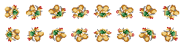
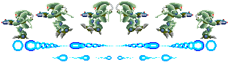

<div align="center">

```
██████╗       ████████╗██╗   ██╗██████╗ ███████╗
██╔══██╗      ╚══██╔══╝╚██╗ ██╔╝██╔══██╗██╔════╝
██████╔╝█████╗   ██║    ╚████╔╝ ██████╔╝█████╗  
██╔══██╗╚════╝   ██║     ╚██╔╝  ██╔═══╝ ██╔══╝  
██║  ██║         ██║      ██║   ██║     ███████╗
╚═╝  ╚═╝         ╚═╝      ╚═╝   ╚═╝     ╚══════╝
```


### 🚀 A Modern C++ Implementation | ECS Architecture | Multiplayer Ready 🎮

```
┌─────────────────────────────────────────────────────────────┐
│  ▶ Press START to begin your journey...                     │
│  ⚠ WARNING: High-performance retro gaming ahead!            │
└─────────────────────────────────────────────────────────────┘
```

[](.)
[](.)
[](.)
[](doc/architecture/ECS_Architecture.puml)

</div>

---

## 🎮 GAME MENU - SELECT YOUR OPTION

<div align="center">

```
╔════════════════════════════════════════════════════════════╗
║                                                            ║
║     ┏━━━━━━━━━━━━━━━━━━━━━━━━━━━━━━━━━━━━━━━━━━━━━━━┓     ║
║     ┃  🚀  QUICK START                               ┃     ║
║     ┗━━━━━━━━━━━━━━━━━━━━━━━━━━━━━━━━━━━━━━━━━━━━━━━┛     ║
║                                                            ║
║     ┏━━━━━━━━━━━━━━━━━━━━━━━━━━━━━━━━━━━━━━━━━━━━━━━┓     ║
║     ┃  📚  DOCUMENTATION LIBRARY                     ┃     ║
║     ┗━━━━━━━━━━━━━━━━━━━━━━━━━━━━━━━━━━━━━━━━━━━━━━━┛     ║
║                                                            ║
║     ┏━━━━━━━━━━━━━━━━━━━━━━━━━━━━━━━━━━━━━━━━━━━━━━━┓     ║
║     ┃  🛠️  BUILD SYSTEM                               ┃     ║
║     ┗━━━━━━━━━━━━━━━━━━━━━━━━━━━━━━━━━━━━━━━━━━━━━━━┛     ║
║                                                            ║
║     ┏━━━━━━━━━━━━━━━━━━━━━━━━━━━━━━━━━━━━━━━━━━━━━━━┓     ║
║     ┃  🏗️  PROJECT STRUCTURE                         ┃     ║
║     ┗━━━━━━━━━━━━━━━━━━━━━━━━━━━━━━━━━━━━━━━━━━━━━━━┛     ║
║                                                            ║
║     ┏━━━━━━━━━━━━━━━━━━━━━━━━━━━━━━━━━━━━━━━━━━━━━━━┓     ║
║     ┃  🎯  FEATURES & SPECS                          ┃     ║
║     ┗━━━━━━━━━━━━━━━━━━━━━━━━━━━━━━━━━━━━━━━━━━━━━━━┛     ║
║                                                            ║
╚════════════════════════════════════════════════════════════╝
```

</div>

---

## 🚀 QUICK START - LEVEL 1

<table>
<tr>
<td width="33%">

###  LINUX MISSION

```bash
# 🎯 OBJECTIVE: Launch the game
./Builder/Linux/linux_build.sh

# 🚀 Deploy the server
./build/r-type_server &

# 🎮 Start the client
./build/r-type_client
```

**💾 Status:** `READY TO DEPLOY`

</td>
<td width="33%">

###  WINDOWS MISSION

```bash
# 🎯 OBJECTIVE: Compile for Windows
./Builder/Windows/windows_build_mingw-w64.sh

# 🚀 Launch server.exe
./build/r-type_server.exe

# 🎮 Launch client.exe
./build/r-type_client.exe
```

**💾 Status:** `CROSS-PLATFORM ENABLED`

</td>
<td width="33%">

###  macOS MISSION

```bash
# 🎯 OBJECTIVE: Build on macOS
cmake -S . -B build -DCMAKE_BUILD_TYPE=Release
cmake --build build -j$(sysctl -n hw.ncpu)

# 🚀 Deploy the server
./build/r-type_server &

# 🎮 Start the client
./build/r-type_client
```

**💾 Status:** `APPLE COMPATIBLE`

</td>
</tr>
</table>

### 🎖️ MANUAL BUILD SEQUENCE (EXPERT MODE)

```bash
┌─[ MISSION CONTROL ]────────────────────────────────────────┐
│                                                             │
│  Step 1: Configure CMake                                   │
│  $ cmake -S . -B build -DCMAKE_BUILD_TYPE=Release          │
│                                                             │
│  Step 2: Build with maximum threads                        │
│  $ cmake --build build -j$(nproc)                          │
│                                                             │
│  Step 3: Launch sequence                                   │
│  $ ./build/r-type_server &                                 │
│  $ ./build/r-type_client                                   │
│                                                             │
│  ✅ MISSION ACCOMPLISHED                                   │
└─────────────────────────────────────────────────────────────┘
```

---

## 📚 DOCUMENTATION LIBRARY - CODEX ACCESS

<div align="center">

```
╔══════════════════════════════════════════════════════════════╗
║  📖 DOCUMENTATION TERMINAL - SELECT YOUR DATA FILE           ║
╚══════════════════════════════════════════════════════════════╝
```

</div>

<table>
<tr>
<td align="center" width="25%">

### 🏛️ ARCHITECTURE

<a href="doc/architecture/ECS_Architecture.puml">
  <b>📐 ECS Blueprint</b>
</a>

`UML Diagram`

</td>
<td align="center" width="25%">

### 📖 ECS GUIDE

<a href="doc/architecture/ECS_Documentation.md">
  <b>🧠 Engine Manual</b>
</a>

`830 lines`

</td>
<td align="center" width="25%">

### ⚡ QUICK START

<a href="doc/Engine_QuickStart.md">
  <b>🚀 Fast Deploy</b>
</a>

`322 lines`

</td>
<td align="center" width="25%">

### 📊 BENCHMARK

<a href="doc/BENCHMARK.md">
  <b>⚡ Performance</b>
</a>

`Stats & Metrics`

</td>
</tr>
</table>

<table>
<tr>
<td align="center" width="25%">

### 📡 NETWORK RFC

<a href="doc/network/RFC_R-Type_Protocol.md">
  <b>📜 Protocol Spec</b>
</a>

`RFC Document`

</td>
<td align="center" width="25%">

### 🔄 SEQUENCE DIAGRAM

<a href="doc/network/Network_Sequence_Diagram.png">
  <b>📊 Message Flow</b>
</a>

`PlantUML`

</td>
<td align="center" width="25%">

### 🔌 DETAILED FLOW

<a href="doc/network/Network_Detailed_Flow.png">
  <b>🔍 Internal Flow</b>
</a>

`Technical`

</td>
<td align="center" width="25%">

### 📨 MESSAGE TYPES

<a href="doc/network/Network_Message_Types.png">
  <b>📦 All Messages</b>
</a>

`Overview`

</td>
</tr>
</table>

<table>
<tr>
<td align="center" width="33%">

### 🏗️ BUILD: CMAKE

<a href="doc/build/CMakeCommand.md">
  <b>🔧 CMake Manual</b>
</a>

`Build Commands`

</td>
<td align="center" width="33%">

### 🪟 BUILD: WINDOWS

<a href="doc/build/WINDOWS_BUILD.md">
  <b>🪟 Win Setup</b>
</a>

`Cross-compile`

</td>
<td align="center" width="33%">

### � DEPLOYMENT

<a href="doc/DEPLOYMENT.md">
  <b>🚀 Deploy Guide</b>
</a>

`Production`

</td>
</tr>
</table>

---

## 🛠️ BUILD SYSTEM - TERMINAL COMMANDS

<div align="center">

```
┏━━━━━━━━━━━━━━━━━━━━━━━━━━━━━━━━━━━━━━━━━━━━━━━━━━━━━━━━━┓
┃  🔧 CMAKE BUILD OPERATIONS                               ┃
┗━━━━━━━━━━━━━━━━━━━━━━━━━━━━━━━━━━━━━━━━━━━━━━━━━━━━━━━━━┛
```

</div>

| 💻 COMMAND | 🎯 FUNCTION | ⚡ SPEED |
|:-----------|:------------|:--------|
| `cmake --build build --target clean_bin` | 🧹 Clean binaries only | FAST |
| `cmake --build build --target fclean` | 💣 Full clean (nuke build) | COMPLETE |
| `cmake --build build --target re` | ♻️ Rebuild from scratch | THOROUGH |

### 🔩 SYSTEM REQUIREMENTS

```
┌─[ MINIMUM SPECS ]──────────────────────────────────────────┐
│  ⚙️  CMake     : 3.15+                                      │
│  💻 Compiler  : C++17 (GCC 7+ / Clang 5+ / MSVC 2017+)     │
│  🐧 Linux     : GCC 7+ / Clang 5+                          │
│  🪟 Windows   : MinGW-w64 (optional, cross-compile)        │
│  🍎 macOS     : Clang (Xcode Command Line Tools)           │
│  🎮 Graphics  : Raylib 5.0 (auto-fetched)                  │
│  🌐 Network   : ASIO 1.29.0 (standalone, auto-fetched)     │
└─────────────────────────────────────────────────────────────┘
```

---

## 🏗️ PROJECT STRUCTURE - MAP LAYOUT

<div align="center">

```
╔═══════════════════════════════════════════════════════════╗
║  🗺️  CODEBASE NAVIGATION SYSTEM                           ║
╚═══════════════════════════════════════════════════════════╝
```

</div>

```
R-Type/
│
├── 📁 src/                          # 🎯 Source Code Sector
│   ├── 🖥️  client/                  # Player-side implementation
│   │   ├── main.cpp
│   │   ├── Graphics/
│   │   └── systems/
│   │
│   ├── 🧠 engine/                   # Core ECS Engine
│   │   ├── ecs/                    # Entity-Component-System
│   │   │   ├── core/               # Registry, ComponentArray
│   │   │   └── components/         # Transform, Velocity, etc.
│   │   ├── graphics/               # IRenderer abstraction
│   │   └── ui/                     # UI components
│   │
│   ├── 🎮 game/                     # Game-specific logic
│   │   ├── Components.hpp
│   │   ├── Systems.hpp
│   │   └── components/
│   │
│   └── 🌐 server/                   # Server-side implementation
│       ├── main.cpp
│       ├── Server.hpp
│       ├── Network/
│       └── systems/
│
├── 📚 doc/                          # 📖 Documentation Zone
│   ├── ECS_Architecture.puml       # System architecture
│   ├── ECS_Documentation.md        # Full ECS guide
│   ├── Engine_QuickStart.md        # Quick tutorial
│   ├── BENCHMARK.md                # Performance data
│   └── build/                      # Build guides
│       ├── CMakeCommand.md
│       └── WINDOWS_BUILD.md
│
├── 🎨 assets/                       # 🖼️ Game Assets
│   ├── sprites/                    # 42 animated GIFs!
│   └── sound/                      # Audio files
│
├── 🏗️  Builder/                     # 🔨 Build Scripts
│   ├── Linux/
│   │   └── linux_build.sh
│   └── Windows/
│       ├── windows_build_mingw-w64.sh
│       └── windows_build_wsl.sh
│
├── ⚙️  cmake/                       # 🔧 CMake Toolchain
│   └── toolchain-mingw.cmake
│
├── 🏭 build/                        # 📦 Compiled Output
│   ├── r-type_client
│   ├── r-type_server
│   └── _deps/                      # External libs (raylib, asio)
│
├── 📄 CMakeLists.txt               # Main build config
├── 📖 README.md                    # You are here! 👈
└── 🔍 Doxyfile                     # Doxygen config
```

---

## 🎯 FEATURES & SPECS - POWER-UPS UNLOCKED

<div align="center">

```
┏━━━━━━━━━━━━━━━━━━━━━━━━━━━━━━━━━━━━━━━━━━━━━━━━━━━━━━━━━┓
┃  ⭐ FEATURE LIST - CAPABILITIES ACQUIRED                 ┃
┗━━━━━━━━━━━━━━━━━━━━━━━━━━━━━━━━━━━━━━━━━━━━━━━━━━━━━━━━━┛
```

</div>

### 🎮 CORE SYSTEMS

| 🔥 FEATURE | 📝 DESCRIPTION | ✅ STATUS |
|:-----------|:---------------|:----------|
| **🧩 ECS Architecture** | Entity-Component-System with SparseSet optimization | `ONLINE` |
| **🌐 Multiplayer** | Client-Server networking with ASIO | `ACTIVE` |
| **🎨 Graphics Engine** | Raylib-powered rendering with IRenderer abstraction | `RENDERING` |
| **🔫 Bullet Patterns** | Advanced bullet hell mechanics | `FIRING` |
| **⚡ Performance** | O(1) component lookups, zero-allocation queries | `OPTIMIZED` |
| **🪟 Cross-Platform** | Linux, Windows, macOS support | `PORTABLE` |
| **🎯 Event System** | Decoupled EventBus communication | `BROADCASTING` |
| **🛡️ Safe Handles** | Generation-tracked entity handles | `PROTECTED` |

### 🚀 TECHNICAL HIGHLIGHTS

<table>
<tr>
<td width="33%">

#### 💾 DATA-ORIENTED

- SparseSet storage
- Cache-friendly iteration
- Minimal allocations

</td>
<td width="33%">

#### 🎭 FLEXIBLE DESIGN

- IRenderable interface
- Headless mode ready
- Modular systems

</td>
<td width="33%">

#### ⚡ HIGH PERFORMANCE

- O(1) lookups
- SIMD-friendly
- Lock-free queries

</td>
</tr>
</table>

---

## 🎮 GAME CONTROLS - INPUT GUIDE

<div align="center">

```
╔═══════════════════════════════════════════════════════════╗
║  🕹️  KEYBOARD MAPPING                                     ║
╚═══════════════════════════════════════════════════════════╝

    [Z]              🔼 Move Up
    
[Q] [S] [D]      ◀️  Down  ▶️  
    
  [SPACE]            💥 Fire
  
   [ESC]             ⏸️  Pause/Menu
```

</div>

---

## 🏆 ACHIEVEMENTS - PROJECT STATS

<div align="center">

```
┌─────────────────────────────────────────────────────────┐
│  🎖️  DEVELOPMENT ACHIEVEMENTS                           │
├─────────────────────────────────────────────────────────┤
│                                                         │
│  ⭐⭐⭐⭐⭐  ECS Master - Complete architecture       │
│  ⭐⭐⭐⭐⭐  Network Pro - Multiplayer ready         │
│  ⭐⭐⭐⭐⭐  Cross-Platform - Multi-OS support       │
│  ⭐⭐⭐⭐⭐  Performance King - Optimized engine     │
│  ⭐⭐⭐⭐⭐  Documentation Lord - 1000+ doc lines   │
│                                                         │
└─────────────────────────────────────────────────────────┘
```

</div>

### 📊 CODE STATISTICS

```
┏━━━━━━━━━━━━━━━━━━━━━━━━┳━━━━━━━━━━━━━━━━━━━━━━━━━━━━━━┓
┃  📈 METRIC              ┃  📊 VALUE                     ┃
┡━━━━━━━━━━━━━━━━━━━━━━━━╇━━━━━━━━━━━━━━━━━━━━━━━━━━━━━━┩
│  Languages             │  C++ (17), CMake              │
│  Architecture          │  Entity-Component-System      │
│  Documentation Lines   │  1000+ (ECS + QuickStart)     │
│  Sprites               │  42 animated GIFs             │
│  Network Protocol      │  Custom ASIO-based            │
│  Build System          │  CMake 3.15+                  │
└────────────────────────┴───────────────────────────────┘
```

---

## 🌟 CREDITS - DEVELOPMENT TEAM

<div align="center">

```
╔═══════════════════════════════════════════════════════════╗
║                                                           ║
║     ████████╗██╗  ██╗ █████╗ ███╗   ██╗██╗  ██╗███████╗  ║
║     ╚══██╔══╝██║  ██║██╔══██╗████╗  ██║██║ ██╔╝██╔════╝  ║
║        ██║   ███████║███████║██╔██╗ ██║█████╔╝ ███████╗  ║
║        ██║   ██╔══██║██╔══██║██║╚██╗██║██╔═██╗ ╚════██║  ║
║        ██║   ██║  ██║██║  ██║██║ ╚████║██║  ██╗███████║  ║
║        ╚═╝   ╚═╝  ╚═╝╚═╝  ╚═╝╚═╝  ╚═══╝╚═╝  ╚═╝╚══════╝  ║
║                                                           ║
║              🚀 Powered by EPITECH Tek3 🚀                ║
║                                                           ║
╚═══════════════════════════════════════════════════════════╝
```


### 👾 MADE WITH 💚 BY THE R-TYPE CREW

**Repository:** [MariusThomassin/R-Type](https://github.com/MariusThomassin/R-Type)  
**Branch:** `Benchmark` | **Version:** `0.1`

</div>

---

<div align="center">

```
╔═══════════════════════════════════════════════════════════╗
║                                                           ║
║                    🎮 GAME OVER 🎮                        ║
║                                                           ║
║              Thanks for playing R-Type!                   ║
║                                                           ║
║         Press [⭐ Star] to save your progress             ║
║                                                           ║
╚═══════════════════════════════════════════════════════════╝
```


**🌟 Star this repository if you found it useful! 🌟**

[](https://github.com/MariusThomassin/R-Type)
[](.)

---

*"In space, no one can hear you compile."* 🚀

</div>
